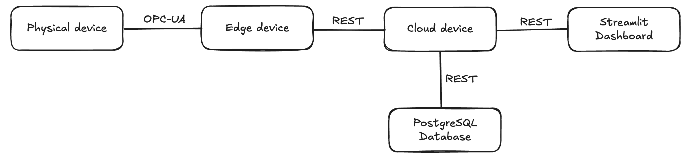

# MFG598 IIoT Project - DMLS 3D Printer Monitoring

## Project Summary

This project addresses the challenge of real-time monitoring and data management for industrial 3D printing operations. Direct Metal Laser Sintering (DMLS) printers require continuous monitoring of critical parameters like temperature distribution, power consumption, and vibration to ensure print quality and prevent equipment failure. Traditional monitoring approaches often lack scalable data pipelines and real-time visualization capabilities.

Our solution implements a three-tier Industrial Internet of Things (IIoT) architecture that bridges the gap between physical sensors and actionable insights. The system collects high-resolution telemetry data (including 10,000-point temperature arrays), processes it at the edge to reduce bandwidth requirements, stores it reliably in the cloud, and presents it through an interactive dashboard. This enables operators to monitor multiple machines in real-time, detect anomalies quickly, and maintain historical records for analysis and quality assurance.

## System Overview

The system follows a three-tier IIoT architecture consisting of physical devices, edge processing, and cloud storage with visualization:



**Architecture Components:**
- **Physical Device Layer**: Simulates DMLS 3D printer sensors, generating telemetry data (100×100 temperature arrays, power, vibration) and transmitting via OPC UA protocol
- **Edge Device Layer**: OPC UA server that buffers and aggregates incoming telemetry, performing preliminary statistics and reducing cloud transmission overhead
- **Cloud Device Layer**: Flask REST API with PostgreSQL database for data ingestion, storage, and retrieval
- **Visualization Layer**: Streamlit dashboard providing real-time monitoring, temperature heatmaps, time-series plots, and historical data browsing

**Technologies Used:** OPC UA (industrial protocol), Flask (REST API), PostgreSQL (database), Streamlit (dashboard), Python asyncio (asynchronous processing)

## How to Run the Project

### Prerequisites
1. Install Python 3.8 or higher
2. Install PostgreSQL and ensure it's running
3. Clone the repository and navigate to the project directory

### Step-by-Step Instructions

**Step 1: Set up the Python environment**
```bash
python -m venv venv
source venv/bin/activate  # On macOS/Linux
pip install -r requirements.txt
```

**Step 2: Configure the database**
- Ensure PostgreSQL is running on your system
- The cloud device will automatically create the required database and tables on first run
- Default configuration uses: `postgresql://localhost/iiot_telemetry`

**Step 3: Start the Cloud Device (Terminal 1)**
```bash
python cloud-device.py
```
The Flask API server will start on `http://localhost:5000`

**Step 4: Start the Edge Device (Terminal 2)**
```bash
python edge-device.py
```
The OPC UA server will start on `opc.tcp://0.0.0.0:4840/freeopcua/server/`

**Step 5: Start the Physical Device Simulator (Terminal 3)**
```bash
python physical-device.py
```
This will begin generating and transmitting telemetry data

**Step 6: Launch the Dashboard (Terminal 4)**
```bash
streamlit run dashboard.py
```
The dashboard will open automatically in your browser at `http://localhost:8501`

### Configuration Options
- Edge device buffer size: Modify `BUFFER_SIZE` in `edge-device.py`
- Cloud API endpoint: Update `CLOUD_URL` in `edge-device.py`
- Database connection: Set `DATABASE_URL` environment variable for custom PostgreSQL connection

## Expected Output

### Dashboard Interface
Once all components are running, the Streamlit dashboard displays:

1. **Machine Selection Panel**: Dropdown to select from available machines (e.g., DMLS-3D-001, DMLS-3D-002)

2. **Real-Time Telemetry Display**:
   - Current temperature statistics (min, max, mean, std dev)
   - Power consumption value in kW
   - Vibration measurement in mm/s
   - Timestamp of last reading

3. **Temperature Heatmap**: 100×100 color-coded visualization showing temperature distribution across the printer bed (20°C to 80°C range)

4. **Time-Series Plots**:
   - Power consumption over time
   - Vibration levels over time

5. **Historical Data Browser**: Navigate through past records with previous/next buttons

### Console Output

**Physical Device:**
```
Connected to OPC UA server at opc.tcp://localhost:4840
Sending telemetry data...
Data sent successfully
```

**Edge Device:**
```
OPC UA Server started at opc.tcp://0.0.0.0:4840/freeopcua/server/
Buffer size: 5
Client connected
Received telemetry from DMLS-3D-001
Sending aggregated data to cloud...
Successfully sent to cloud
```

**Cloud Device:**
```
 * Running on http://127.0.0.1:5000
Received telemetry for machine: DMLS-3D-001
Data stored successfully with ID: 1
```

## Components

### Physical Device (`physical-device.py`)
Simulates a DMLS 3D printer sensor array that generates telemetry data. The physical device collects:
- **Temperature data**: 10,000 temperature readings (100×100 sensor array) ranging from 20°C to 80°C
- **Power consumption**: Machine power usage in kW
- **Vibration**: Vibration measurements in mm/s

The device transmits data via OPC UA protocol to the edge device, mimicking real industrial equipment communication standards.

### Edge Device (`edge-device.py`)
Serves as an intermediary OPC UA server that receives telemetry from physical devices and forwards processed data to the cloud. Key functions include:
- Buffers incoming telemetry data (configurable buffer size)
- Averages multiple data points to reduce cloud transmission overhead
- Calculates preliminary statistics (min, max, mean, standard deviation)
- Sends aggregated data to the cloud device via HTTP REST API

### Cloud Device (`cloud-device.py`)
A Flask-based REST API server that acts as the cloud data ingestion and storage layer. Features include:
- Receives telemetry data from edge devices via HTTP POST
- Stores data in a PostgreSQL database with full telemetry history
- Computes and stores temperature statistics for each record
- Provides REST endpoints for data retrieval filtered by machine ID or time range
- Supports querying machine lists and retrieving specific records

### Dashboard (`dashboard.py`)
An interactive Streamlit web application for real-time monitoring and data visualization. The dashboard provides:
- Machine selection and filtering capabilities
- Real-time telemetry data display with auto-refresh
- Temperature heatmap visualization (100×100 grid)
- Time-series plots for power consumption and vibration
- Statistical summaries (min, max, mean, standard deviation)
- Historical data browser with record-by-record navigation

## Technology Stack
- **OPC UA**: Industrial communication protocol for device-to-edge communication
- **Flask**: RESTful API framework for cloud services
- **PostgreSQL**: Relational database for telemetry data storage
- **Streamlit**: Interactive dashboard framework
- **Python asyncio**: Asynchronous programming for OPC UA operations
